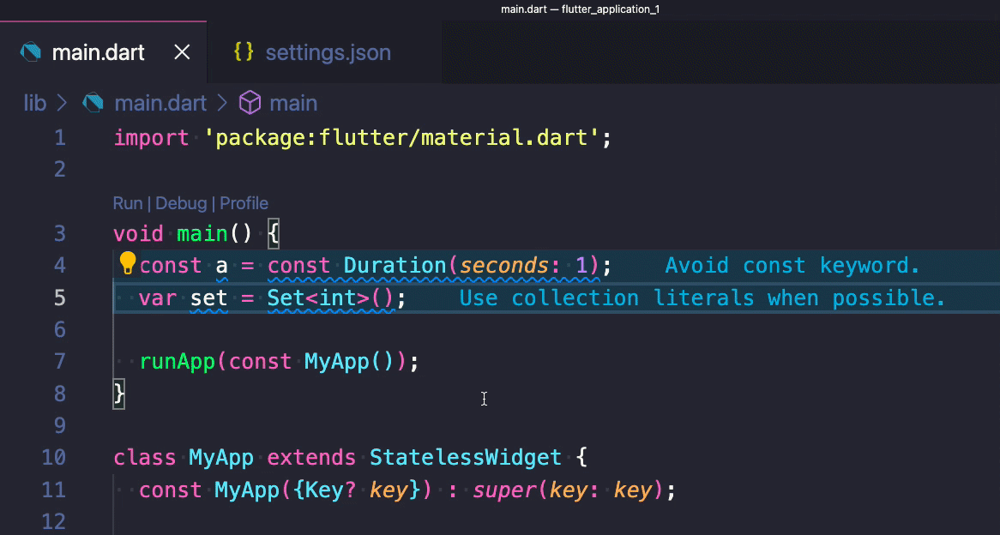

# Flutter Fix all command

The Flutter "Fix All" command is great!

But you know what's even better?

Fix All on Save. 🚀

Just add "source.fixAll" to "editor.codeActionsOnSave" on your VSCode settings and you're good to go!

 

| Previous | Next |
| -------- | ---- |
| [Use the DevTools to identify Jank and Shader compilation issues](../0005-use-the-devtools-to-identify-jank-and-shader-compilation-issues/index.md) | [How to set the border radius on a Flutter container](../0007-how-to-set-the-border-radius-on-a-flutter-container/index.md) |