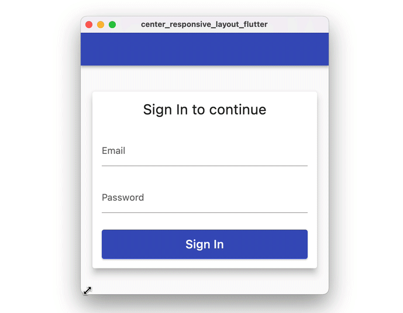
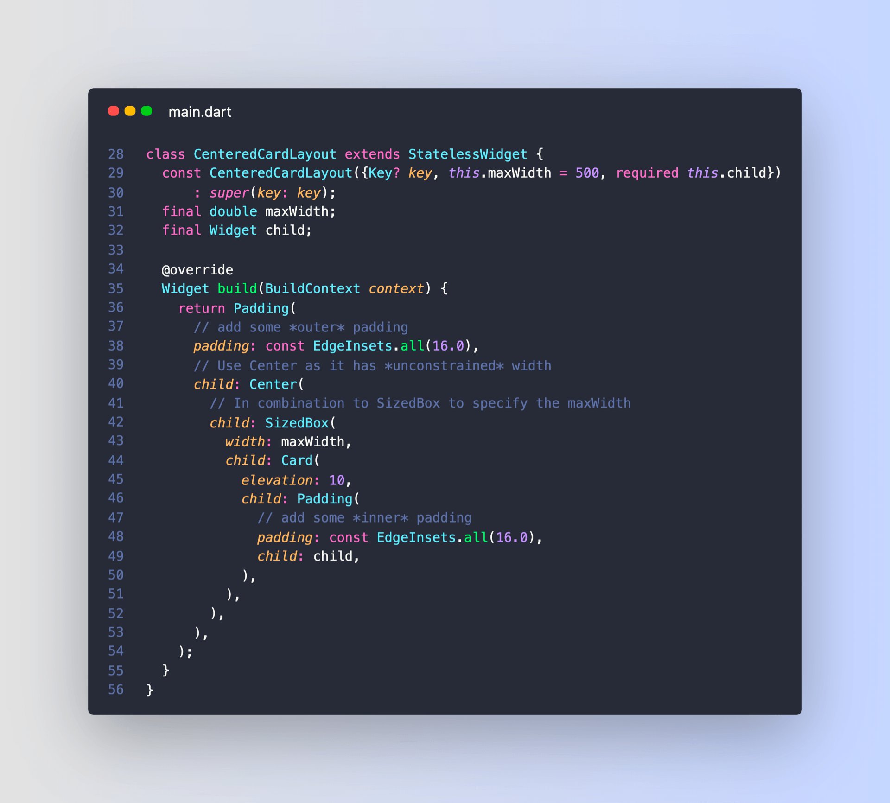

# Responsive Flutter card layout with SizedBox & Center

How do you create a Flutter card layout that grows horizontally up to a given width, then remains fixed at that width just like in this example?

---

This can be done by composing `Center` and `SizedBox` widgets like so:

---

Why does this work?

Well, it's all about **tight** vs **loose** constraints:

- Center has loose constraints
- SizedBox has tight constraints

Combine them together for profit.

This excellent article by [@mhadaily](https://twitter.com/mhadaily) explains all the details:

- [Best practices for laying out your Flutter app](https://blog.logrocket.com/best-practices-laying-out-flutter-app/)
 

| Previous | Next |
| -------- | ---- |
| [How to Validate a `TextField` in Flutter](../0012-how-to-validate-a-textfield-in-flutter/index.md) | [How to navigate programmatically between tabs in Flutter](../0014-how-to-navigate-programmatically-between-tabs-in-flutter/index.md) |