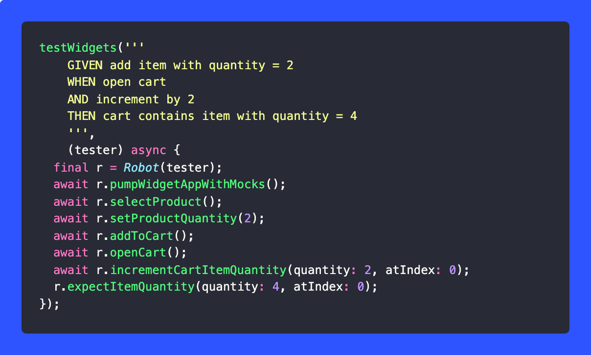
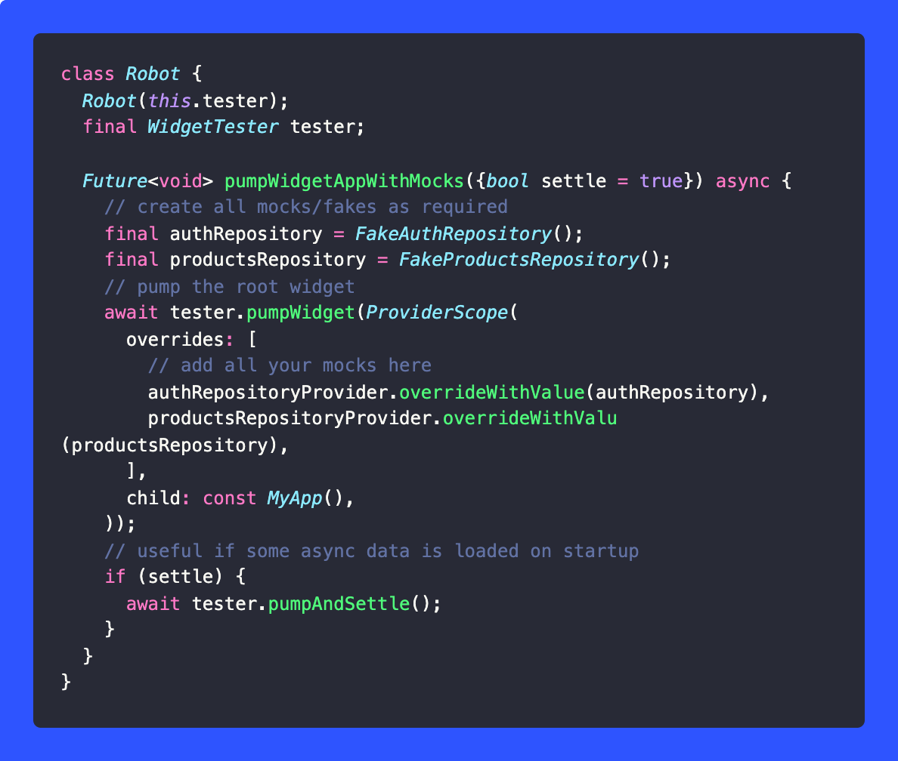
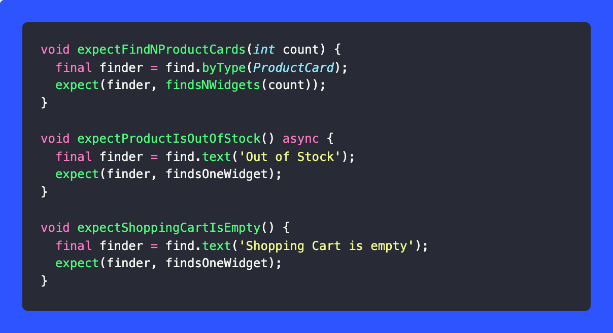
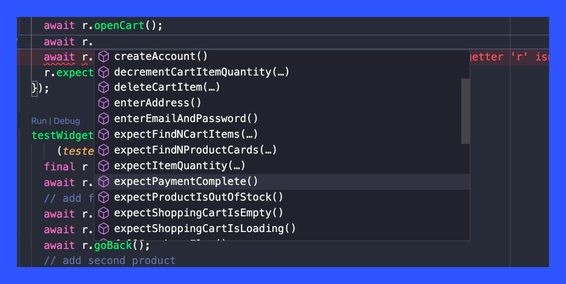

# How to use Robot Testing to write more readable widget tests

Would you like your widget tests to be **readable**?

Just create a Robot class that defines each step as a method.

How is this implemented? Let's take a look. 🧵

---

Our Robot class should take the WidgetTester as an argument.

Then we can define a convenience method that pumps the root widget and sets all the mocks we need (we use Riverpod in this example):

---

Then, we can define each testing step as a separate **atomic** method.

Inside it, we can use the finder and tester as usual:

---

We can also write expectations as methods inside the `Robot` class:

---

The net result?

We can write widget tests with a human-readable syntax. 🎉

And because each testing step is defined inside the `Robot` class, autocomplete makes our life easier. 🚀

----

I first discovered this technique in this article by [@jcocaramos](https://twitter.com/jcocaramos) at [@VGVentures](https://twitter.com/VGVentures):

- [Robot Testing: Code written by engineers and readable by well, everyone](https://verygood.ventures/blog/robot-testing-in-flutter)

And I have added some modifications to make it usable with both widget and integration tests.

----

Want more Flutter tips like these?

Then just follow me: [@biz84](https://twitter.com/biz84)

 
| Previous | Next |
| -------- | ---- |
| [How to create a Flutter GridView with content-sized items](../0018-how-to-create-a-flutter-gridview-with-content-sized-items/index.md) | [How to configure multiple Firebase environments with FlutterFire CLI](../0020-how-to-configure-multiple-firebase-environments-with-flutterfire-cli/index.md) |