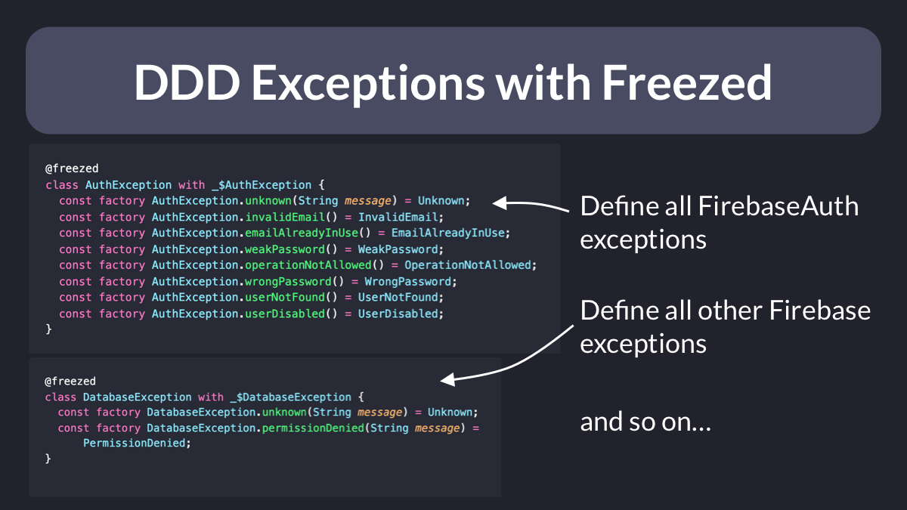
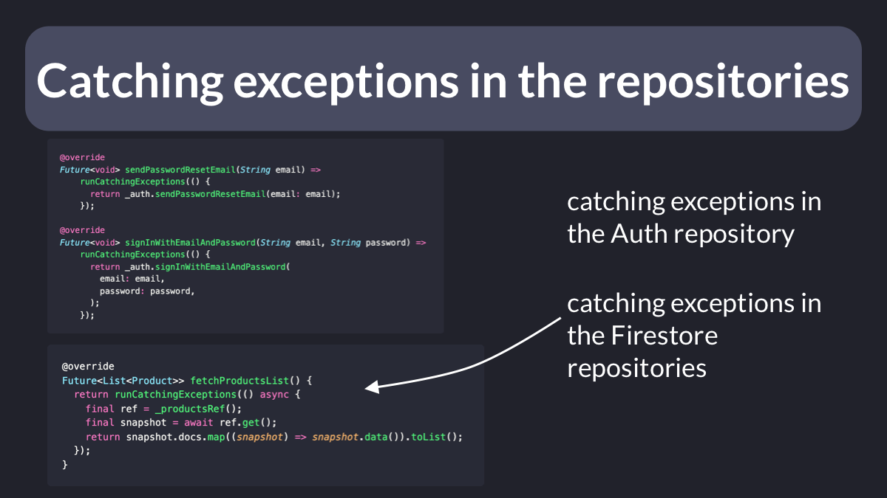
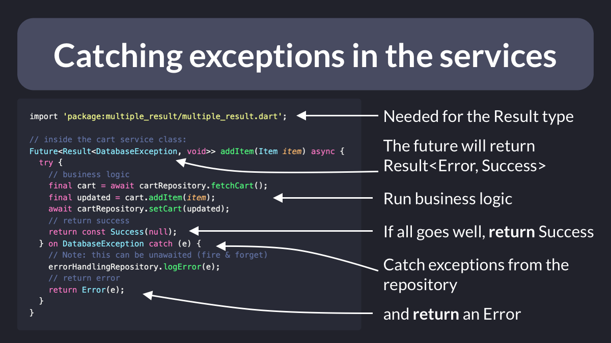
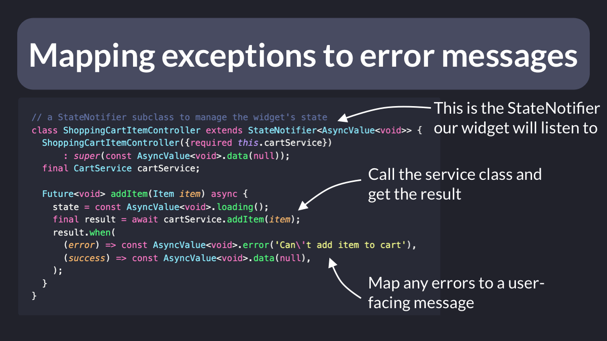

# Domain-Driven Exception Handling

How do we apply Domain-Driven Design to exception handling?

I've been experimenting with some techniques and would love your feedback about this thread. 🧵

First of all, let's establish some goals: 👇

---

To define all the domain-specific exceptions, sealed unions come to hand.

Here's how we may generate Auth and Database exception types using Freezed:

---

Then we can define one **global** function that does two things:

- run the `Future<T>` that is given as an argument inside a `try`/`catch` block
- map all 3rd-party exceptions to our own exception types (and throw them)

---

Inside our repositories, we can wrap each Future-based API with the `runCatchingExceptions()` function.

As a result, if the code throws, it will throw any of our own exception types.

---

And when we implement the service classes in the application layer, we can:

- run any business logic using our repositores
- catch our exceptions
- return (not throw) them using a Result type that can contain Error or Success

This is also a good place to **log** exceptions.

---

Nearly there!

If we use `StateNotifier` to control our widget's state, we can:

- call the method in the service class
- get the result and map it to an error/success state

----

And finally, in the widgets we can watch the state and listen for errors (I have already covered this before):

- [How to handle loading and error states with StateNotifier & AsyncValue in Flutter](https://codewithandrea.com/articles/loading-error-states-state-notifier-async-value/)

---

The end result?

- we catch all exceptions from the **outside world** by wrapping all async repository methods with the `runCatchingExceptions()` function
- the rest of our app only deals with exceptions that belong to the domain model

(continued)

---

- (optional) service classes will catch exceptions and return a `Result<Error, Success>` type
- (optional) controller classes will use Result type and easily map any errors to user-facing messages

This encourages us to define every possible error state and show it in the UI.

---

One drawback of this approach is that we now rely on Freezed code generation to define sealed unions for all error types.

Depending on the project, code generation can be slow - though this can be somewhat mitigated:

- [How to speed up code generation with build_runner in Dart & Flutter](https://codewithandrea.com/tips/speed-up-code-generation-build-runner-dart-flutter/)

---

So far, what I presented is a WIP and there are some things I want to figure out.

- How to apply the same approach to Streams rather than Futures?
- Should we map `Stream<T>` to `Stream<Result<Error, T>>` everywhere? Seems complicated in practice.

(continued)

---

Another issue is that having more than one exception type (e.g. `AuthException`, `DatabaseException`) can make it hard to map errors across the different layers.

Maybe it would be best to define just ONE exception type with all possible errors (it's a sealed union after all).

---

I want experiment more with this topic and find a robust solution that works well without adding too much mental overhead.

Did you like this thread? Anything you would have done differently?

Let me know in the comments. 👇

---

There is so much to cover around app architecture, error handling, and domain-driven design.

And I've done my best to make it justice in my Flutter course:
 

| Previous | Next |
| -------- | ---- |
| [DDD: The Domain Model](../0028-ddd-the-domain-model/index.md) | [VSCode launch configurations](../0030-vscode-launch-configurations/index.md) |