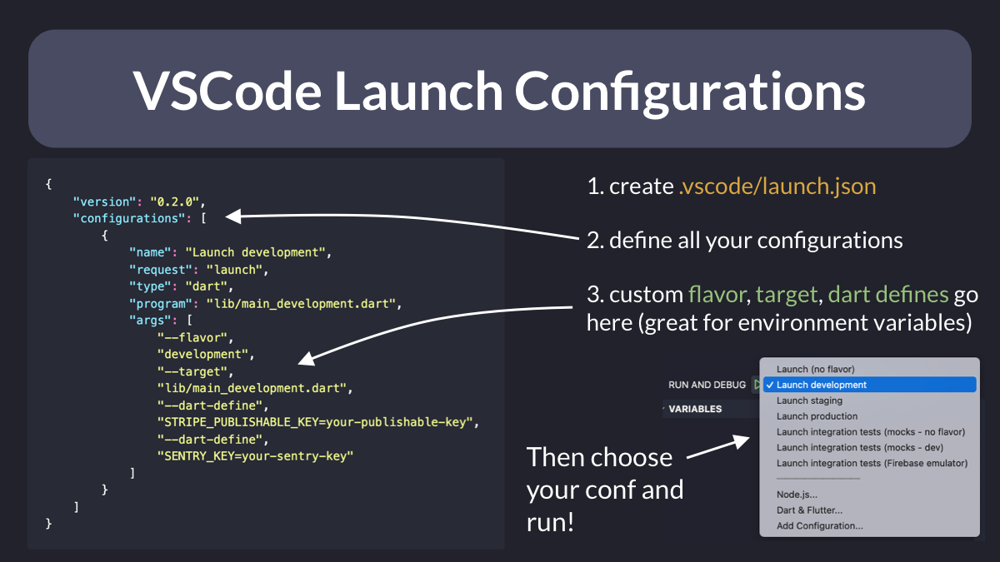
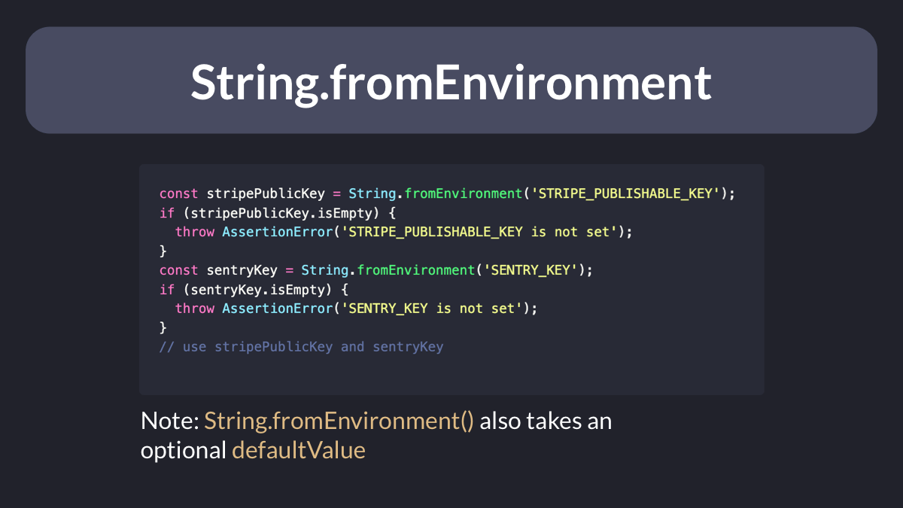

# VSCode launch configurations

Want to quickly switch between multiple flavors/targets/environments in your Flutter apps?

Just add a `.vscode/launch.json` file with custom arguments for each configuration.

This lets you set environment variables as key=value pairs using `--dart-define`:

---

Then, in your Flutter code, you can read all the environment variables using `String.fromEnvironment()`:

 

| Previous | Next |
| -------- | ---- |
| [Domain-Driven Exception Handling](../0029-domain-driven-exception-handling/index.md) | [How to use the Flutter Widget Inspector](../0031-how-to-use-the-flutter-widget-inspector/index.md) |