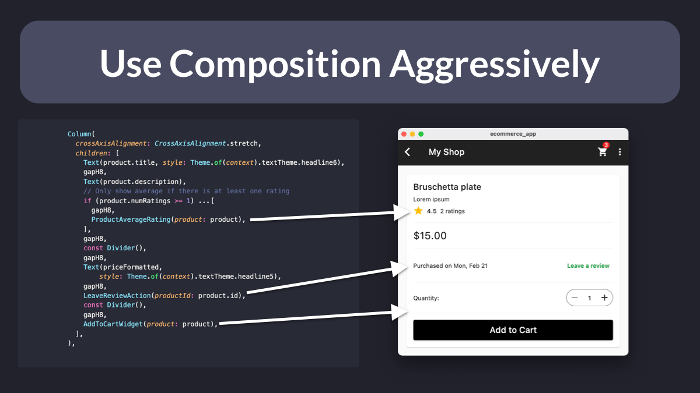

# Flutter tip: use composition aggressively

Most widgets in the Flutter SDK use composition aggressively.

By doing the same in our own apps, we can create small, reusable widgets that are easier to reason about.

Embrace this and banish the massive build method from existence! 💪

Your future self will thank you. 😉

 

| Previous | Next |
| -------- | ---- |
| [How to use the Flutter Widget Inspector](../0031-how-to-use-the-flutter-widget-inspector/index.md) | [VSCode extensions to speed-up your Flutter workflow](../0033-vscode-extensions-to-speed-up-your-flutter-workflow/index.md) |