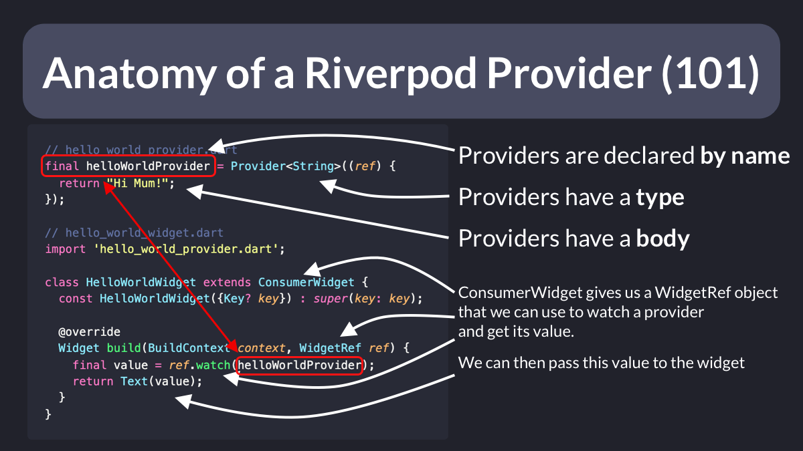

# Anatomy of a Riverpod Provider

So, how do you use providers with Riverpod?

- Create the provider, giving it a name, type and body
- Update your widget to extend `ConsumerWidget`
- Add a `WidgetRef` to the build method and use it to watch the provider
- Use the value in your widget

More Riverpod tips incoming.👌

 

| Previous | Next |
| -------- | ---- |
| [Flutter Project Structure: Feature-first or Layer-first?](../0039-flutter-project-structure-feature-first-or-layer-first/index.md) | [Using Fake Repositories for Testing](../0041-using-fake-repositories-for-testing/index.md) |