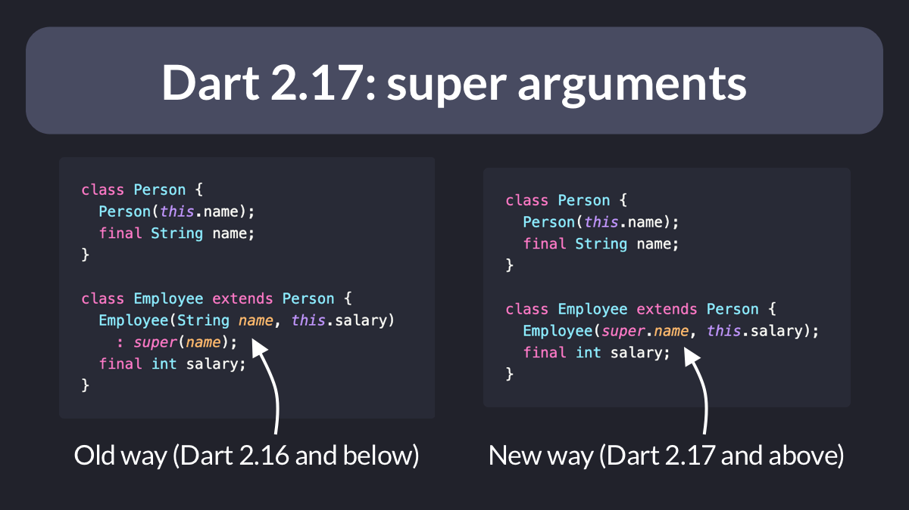

# Dart 2.17: Super Initializers

Did you know?

Starting from Dart 2.17, you can pass arguments to the superclass with a new shorthand syntax. 👇

Works with both named and positional arguments. 

 

| Previous | Next |
| -------- | ---- |
| [Testing functions that throw](../0048-testing-functions-that-throw/index.md) | [Dart 2.17: Enhanced Enums with Members](../0050-dart-2-17-enhanced-enums-with-members/index.md) |