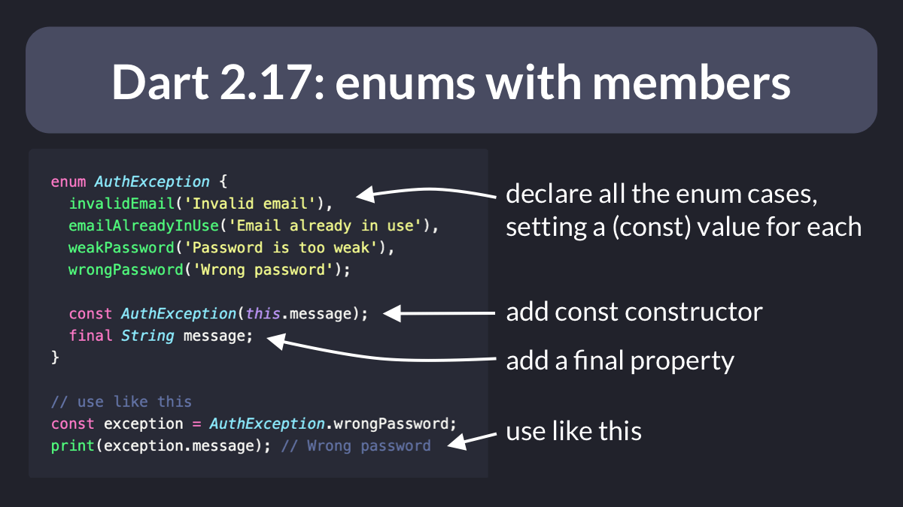
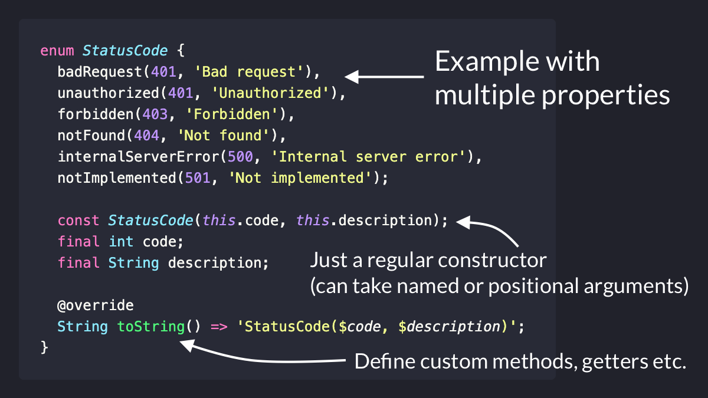

# Dart 2.17: Enhanced Enums with Members

Did you know?

Since Dart 2.17, you can declare enums with members. 🚀

See below for another example. 👇

---

What else can you do with this?

- Define multiple properties
- Add named or positional arguments to the constructor (as long as it's a `const` constructor)
- Define custom methods and getters

---

Want more Flutter tips like this?

Then just follow me: [@biz84](https://twitter.com/biz84)

Happy coding!
 

| Previous | Next |
| -------- | ---- |
| [Dart 2.17: Super Initializers](../0049-dart-2-17-super-initializers/index.md) | [Golden Image Testing with Robot Testing](../0051-golden-image-testing-with-robot-testing/index.md) |