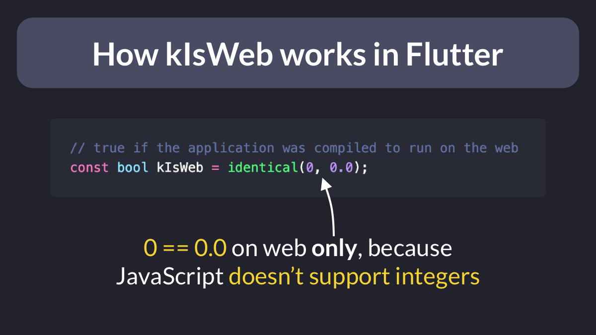

# How `kIsWeb` works in Flutter

Do you know how `kIsWeb` is implemented in Flutter?

Here it is:

```dart
const bool kIsWeb = identical(0, 0.0);
```

Explanation:

- on web, Dart's doubles and ints are backed by the same kind of object (JS doesn't support integers)
- on the Dart VM, doubles and ints are different



---

Here's the official documentation:

- [kIsWeb top-level constant](https://api.flutter.dev/flutter/foundation/kIsWeb-constant.html)

 

| Previous | Next |
| -------- | ---- |
| [Explicit error types with Either](../0064-all-riverpod-providers/index.md) | [The HtmlUnescape package](../0066-html-unescape/index.md) |