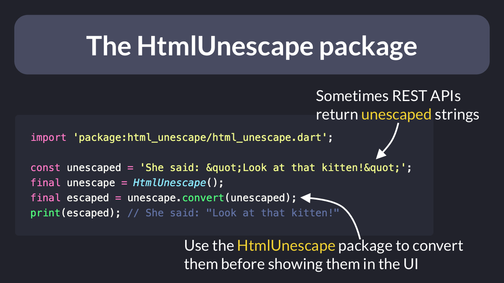

# The HtmlUnescape package

Ever worked with a REST API that returns a bunch of escaped Strings?

Use the HtmlUnescape package to convert them before you show them in the UI. 👇

Link: [HTMLUnescape package](https://pub.dev/packages/html_unescape)



```dart
import 'package:html_unescape/html_unescape.dart';

const unescaped = 'She said: &quot;Look at that kitten!&quot;';
final unescape = HtmlUnescape();
final escaped = unescape.convert(unescaped);
print(escaped); // She said: "Look at that kitten!"
```
 

| Previous | Next |
| -------- | ---- |
| [How `kIsWeb` works in Flutter](../0065-kIsWeb/index.md) | [REST Client extension for VSCode](../0067-rest-client-vscode/index.md) |