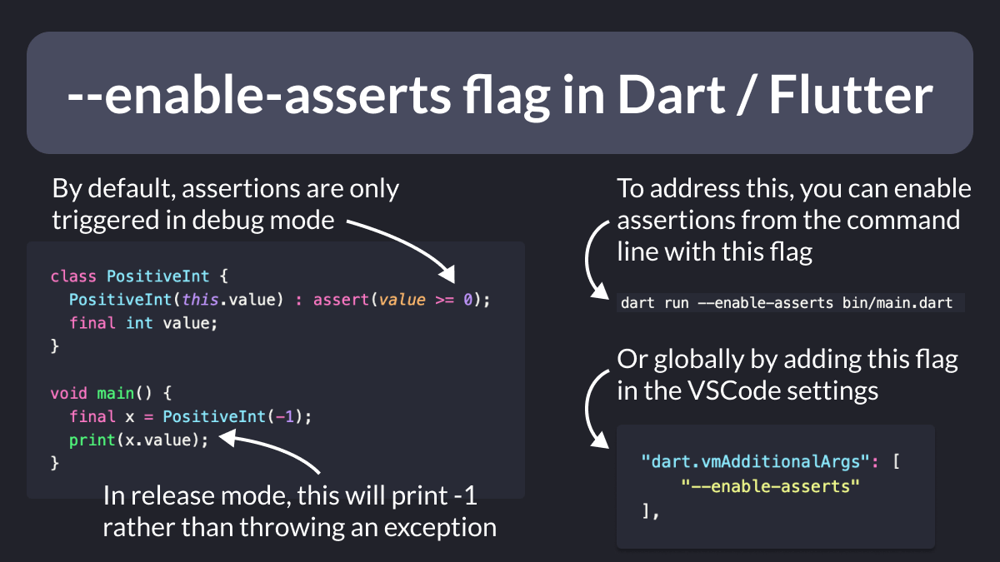

# --enable-asserts flag in Dart / Flutter

When running a Dart or Flutter app, assertions are only enabled in Debug mode.

But in Release mode, they are disabled by default.

To change this behavior, add the `--enable-asserts` flag when running from the command line.

Or set it globally in your VSCode settings file.

 

| Previous | Next |
| -------- | ---- |
| [REST Client extension for VSCode](../0067-rest-client-vscode/index.md) | [When to use `SizedBox.shrink()` to return an empty box](../0069-sizedbox-shrink/index.md) |