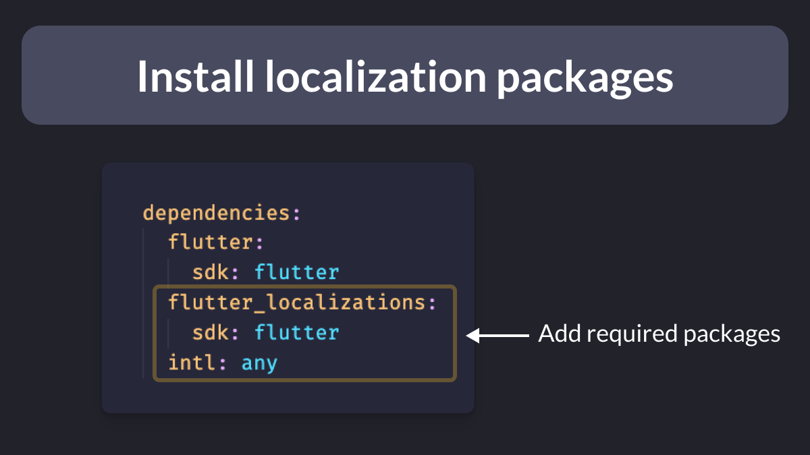
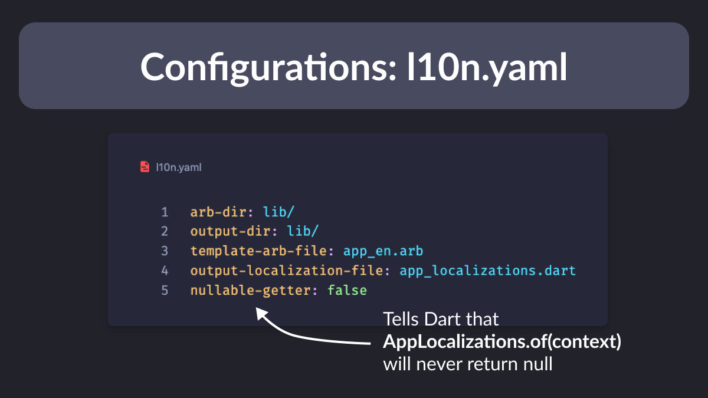
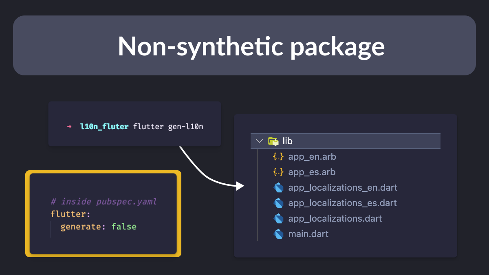
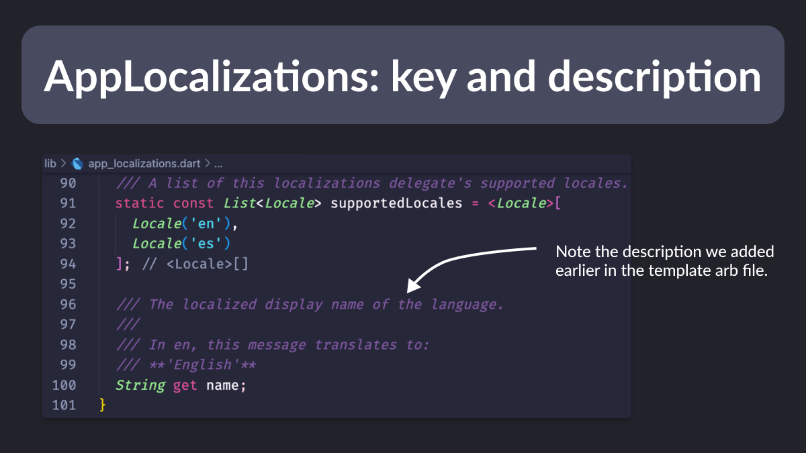
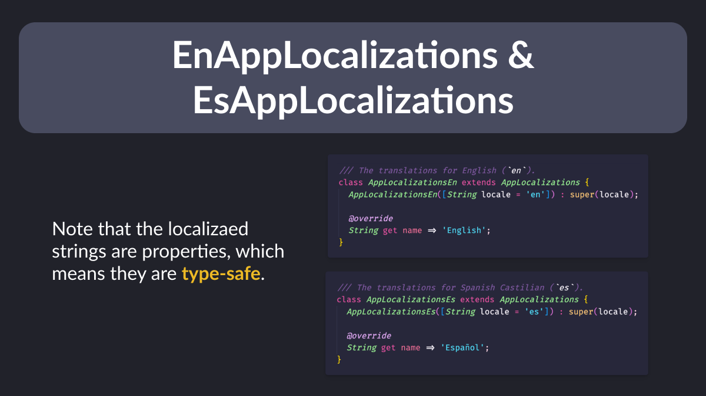
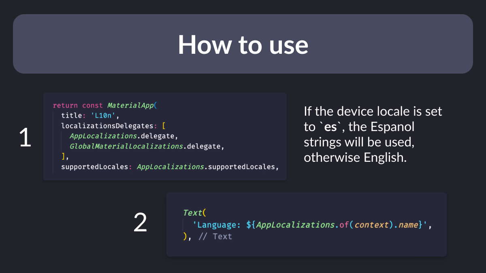
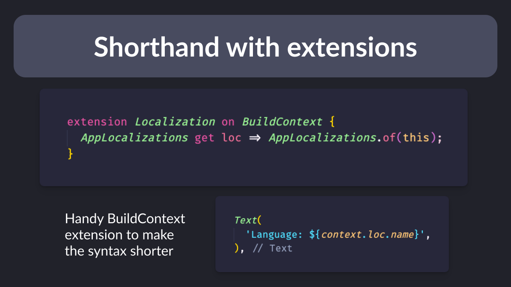

# Flutter app localization in 5 min

If your users speak another language, you’ll need to localize your Flutter app 🗺

Here’s how to setup Flutter app localizations in just 5 minutes, using code generation.

Also covered: template vs non-template files and synthetic vs non-synthetic package. 👀

🧵 

---

1️⃣  As a first step, we need to add the required packages to the pubspec.yaml file.

---

2️⃣ Create `l10n.yaml` at the root

✔️ `arb-dir` is the input folder where Flutter will look for the localized strings
✔️ `output-dir` is where the localizations classes will be generated
✔️ `template-arb-file` is the main template that contains a description for each localized message

---

3️⃣ Create the ARB files inside the chosen input folder

An ARB file is an “application resource bundle” used by Flutter to generate corresponding Dart files. Each locale will have its own ARB file.

For example, to add French, just create app_fr.arb in the same directory.

---

4️⃣ Add the `@@locale` key and the first key/value pair. Note that there is a small difference between the file we declared as a template in l10n.yaml and other ARB files.

---

5️⃣ Synthetic or non-synthetic?

The localizations files can either be generated as a synthetic or non-synthetic package.

Let's see what this means and which one we should choose.👇🏻

---

5️⃣ Synthetic

Set `generate: true` in pubspec.yaml, then run `flutter gen-10n` at the root using the terminal.

This will generate a new package under .dart_tool, which ignores the `output-dir` we specified earlier in `l10n.yaml`.

---

5️⃣ Non-synthetic

We might want the localizations files to be in the `output-dir`, as `.dart_tool` is often ignored.

Add a new key to `l10n.yaml`: `synthetic-package: false`.

This will let Flutter know we need a non-synthetic package (it is true by default).

---

Let’s explore the generated files 🔍

Inside the main file (`app_localizations.dart`), we can notice the key `name` from the ARB template, along with the description. 

The `AppLocalizations` class is an abstract class that will be extended by every locale delegate.

---

In this example we defined 2 locales, so we have a Dart file for each one of them.

👉🏻 `app_localizations_en.dart`
👉🏻 `app_localizations_es.dart`

As noted earlier, both extend the `AppLocalizations` base class.

---

6️⃣ Finally, we need to add the localizations delegate to our `MaterialApp`. 

We can then use it anywhere in the app!🚀

---

Bonus: `BuildContext` extension 🧩

This is not required, but helps us make the syntax shorter.

---

To learn more about localization, read this guide which explains the process more in detail:

- [Simplified Flutter Localization using a BuildContext extension](https://codewithandrea.com/articles/flutter-localization-build-context-extension/)

 

| Previous | Next |
| -------- | ---- |
| [When to use `SizedBox.shrink()` to return an empty box](../0069-sizedbox-shrink/index.md) | [Prefer `const` over `final` over `var`](../0071-const-vs-final-vs-var/index.md) |