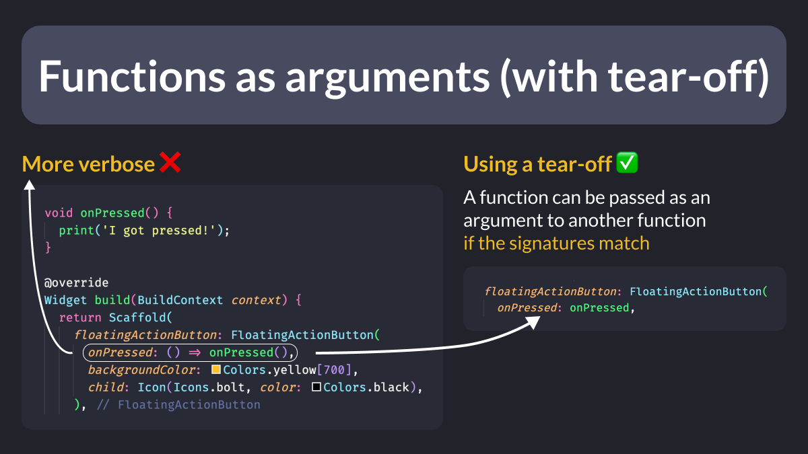

# Functions as arguments (with tear-off)

Functions are first-class citizens in Dart.

They can be passed directly as arguments, provided that the type signatures match.

This is known as a function tear-off.

Since Dart 2.15, we can use constructor tear-offs too. 👍

 

| Previous | Next |
| -------- | ---- |
| [How to define type aliases in Dart](../0073-enhance-readability-with-typdef/index.md) | [Using `build_runner` in watch mode](../0075-build-runner-watch/index.md) |
