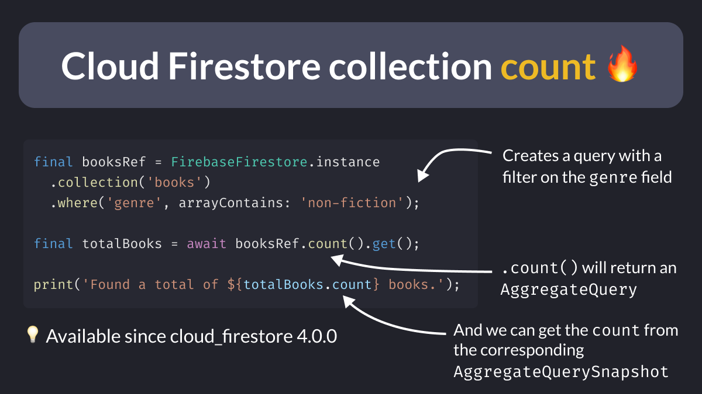

# Cloud Firestore collection count

Getting the collection count in Firestore just got much easier (and cheaper!) 🔥

Aggregate queries work like normal queries.

But they return an AggregateQuerySnapshot that contains metadata (such as count), instead of actual documents. 🧮

 

| Previous | Next |
| -------- | ---- |
| [How to use the new Riverpod Generator package](../0081-future-provider-riverpod-generator/index.md) | [Update packages with the Version Lens VSCode extension](../0083-version-lens-vscode/index.md) |