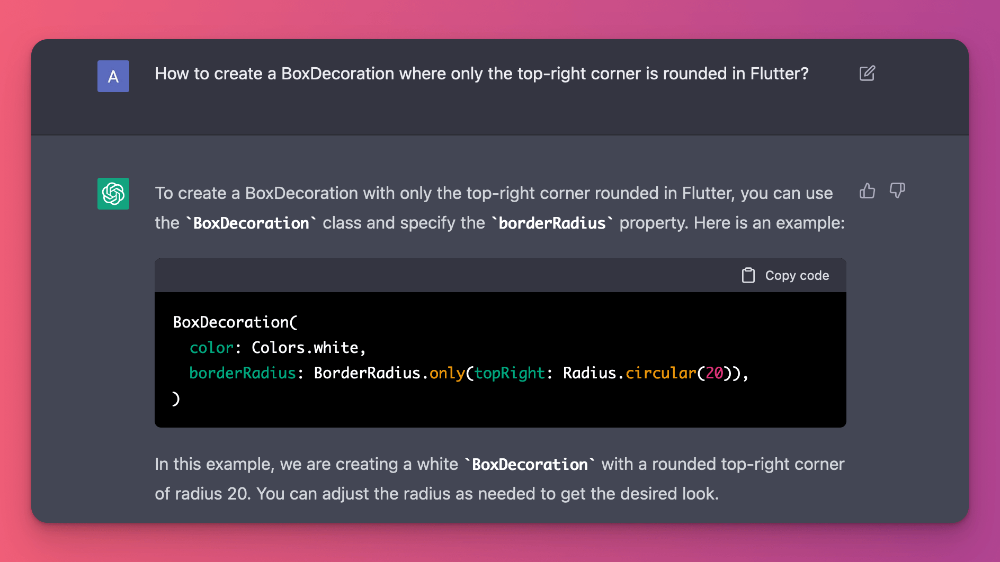
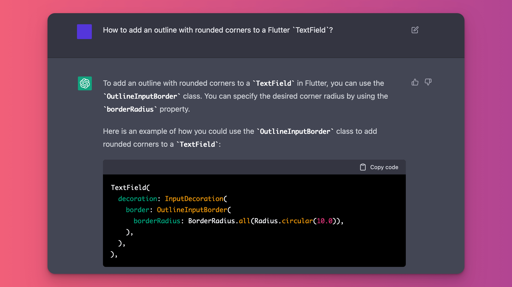

# Use ChatGPT to do custom styling in Flutter

I always forget the API syntax to do custom styling in Flutter (such as drawing rounded corners or adding an outlined border a TextField).

Well, ChatGPT seems like the perfect tool for these kind of questions.

So make the most of it! 👌

 
| Previous | Next |
| -------- | ---- |
| [Using the query builder UI in Cloud Firestore](../0084-firestore-query-builder/index.md) | [Dart code samples in the Firebase docs](../0086-firebase-docs-dart-samples/index.md) |