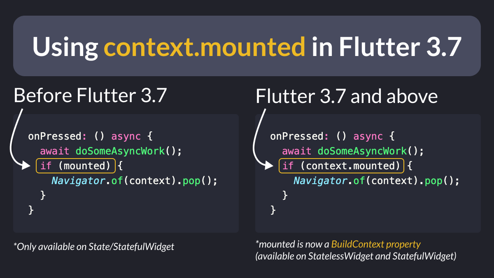

# Using `context.mounted` in Flutter 3.7

Up until recently, it wasn't possible to check if a `StatelessWidget` was mounted in Flutter.

But since Flutter 3.7, `BuildContext` itself has a `mounted` property! 🎉

This makes it easy to check if **any** widget is mounted.

That's a great quality-of-life improvement. 👌

| Previous | Next |
| -------- | ---- |
| [Using `serverTimestamp()` in Firestore](../0089-server-timestamp/index.md) | [Got linter issues? Use `dart fix --apply`](../0091-dart-fix-apply/index.md) |