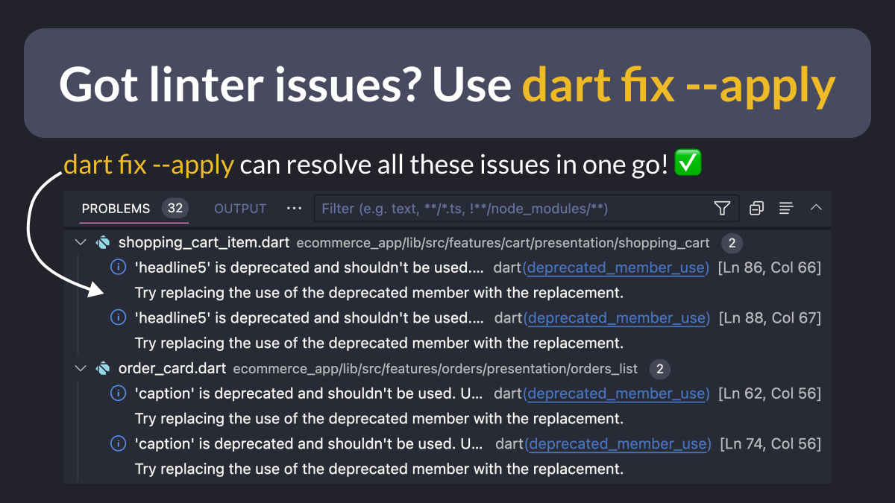

# Got linter issues? Use `dart fix --apply`

Ever tried to update an old Flutter project to the latest APIs and got a ton of linter issues? 😭

For example, all the default text styles have been renamed in Flutter 3.7. 🙄

In cases like this, just run `dart fix --apply`. 🚀

And you're good to go! 👌

---

There's much more to know about dart fix, the Flutter analyzer, and ways to fix errors automatically in VSCode.

For all the details, check the latest tip on my website:

- [How to update old Flutter projects with Dart Fix --apply](https://codewithandrea.com/tips/dart-fix-apply/)

 
| Previous | Next |
| -------- | ---- |
| [Using `context.mounted` in Flutter 3.7](../0090-context-mounted/index.md) | [Firebase Billing and Cost Calculator](../0092-firebase-billling/index.md) |