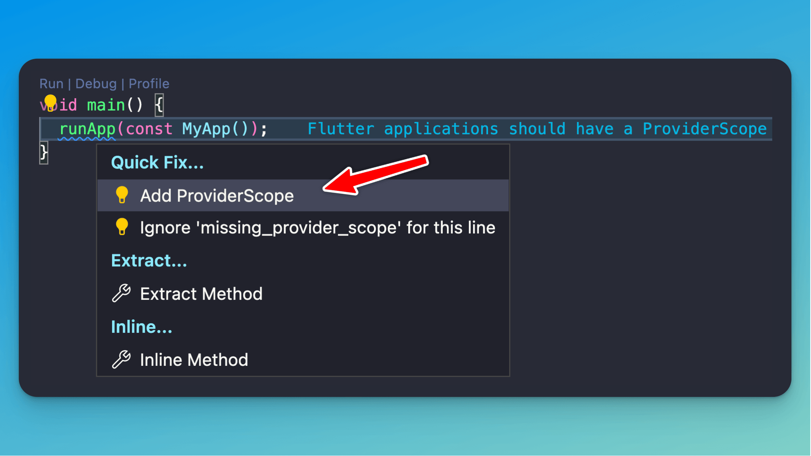

# Fix missing `ProviderScope` error with Riverpod Lint

Say goodbye to common errors in your Flutter apps with the new Riverpod Lint package!

This package will:

- Tell you when you're missing a ProviderScope in your root widget
- Provide a Quick Fix option to resolve it quickly

More tips (and a new article) are coming soon. 😉

 
| Previous | Next |
| -------- | ---- |
| [Add a part file with Riverpod Snippets](../0093-riverpod-part/index.md) | [StreamProvider with RiverpodGenerator](../0095-stream-provider-generator/index.md) |

