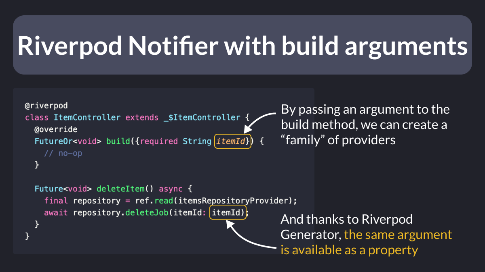

# Riverpod Notifier with build arguments

Just learned something fun and useful with Riverpod!

You can pass an argument to the build method, and it will be automatically accessible in *all* the other methods. 🤩

That's because Riverpod Generator stores it as a property in the parent class. 👍

 

| Previous | Next |
| -------- | ---- |
| [Cloud Firestore - Cache Size](../0096-cloud-firestore-cache-size/index.md) | [Pagination with FirestoreListView](../0098-firestore-list-view/index.md) |
