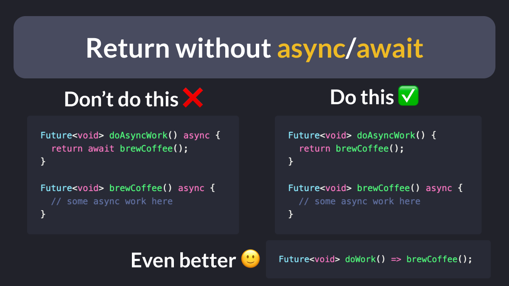
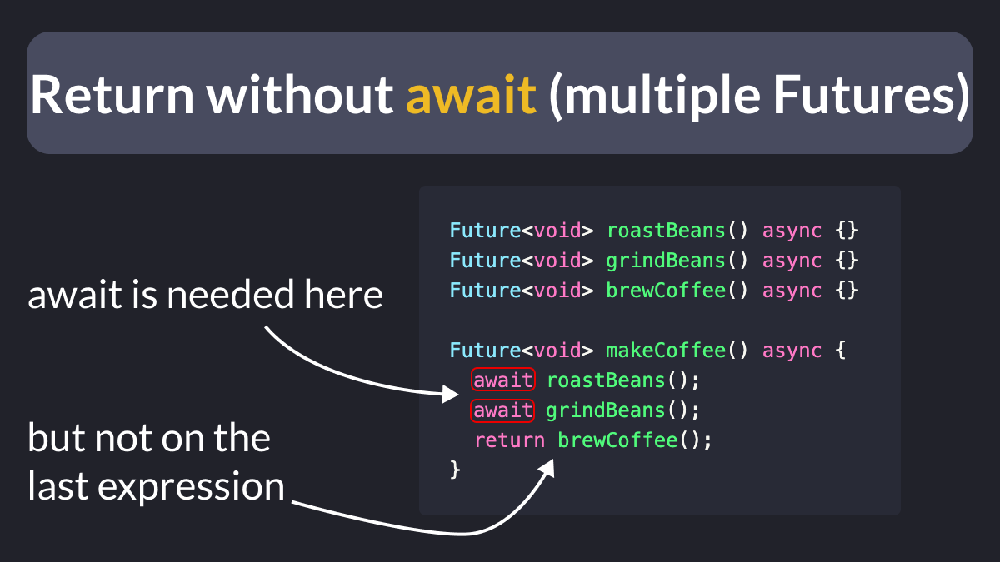

# Return without `async`/`await`

Did you know that when a function returns a `Future`, you don't need to use `async`/`await`?

That works as long as the return type matches the type of the expression being returned (e.g. they are both `Future<void>`).

---

Of course, if you have more than one `Future`, you have to use `async`/`await`.

But you can still omit the `await` on the return statement at the end.

---

| Previous | Next |
| -------- | ---- |
| [Creating an empty Flutter project](../0105-flutter-create-empty/index.md) | [Happy Birthday with records in Dart 3](../0107-happy-birthday-records-dart-3/index.md) |

