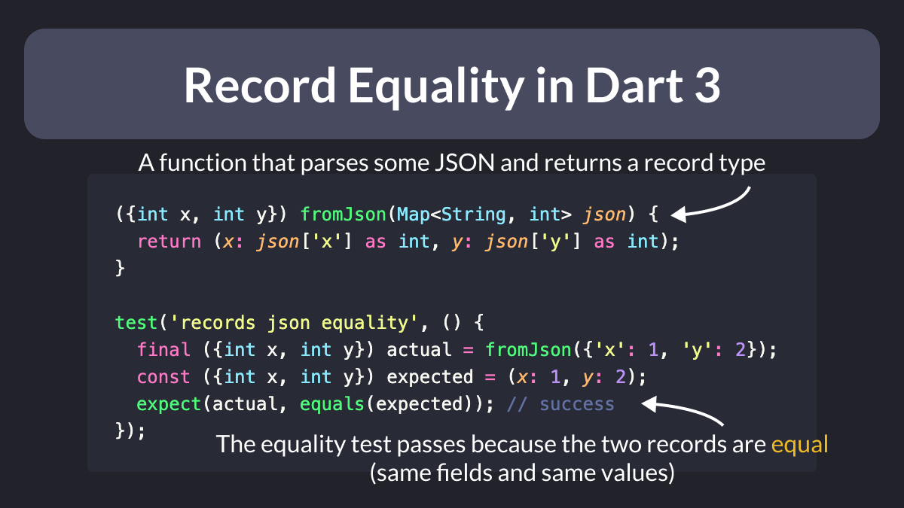

# Record Equality in Dart 3

Did you know?

In Dart, two records are considered equal if they have:
- the same fields (named and positional)
- the same values for each field

This makes them a good lightweight alternative to classes when you need to return multiple values (and potentially compare them).

---

On the other hand, two *distinct* instances of the same class will NOT be considered equal, even if they have the SAME values, UNLESS we've implemented the == operator.

P.S. Don't overuse records: classes are still the way to go if you need to store data AND functionality. 👍

| Previous | Next |
| -------- | ---- |
| [MediaQuery as InheritedModel](../0108-media-query-inherited-model/index.md) | [Getting a `Future` from a `FutureProvider` with Riverpod](../0110-riverpod-watch-future-provider/index.md) |
