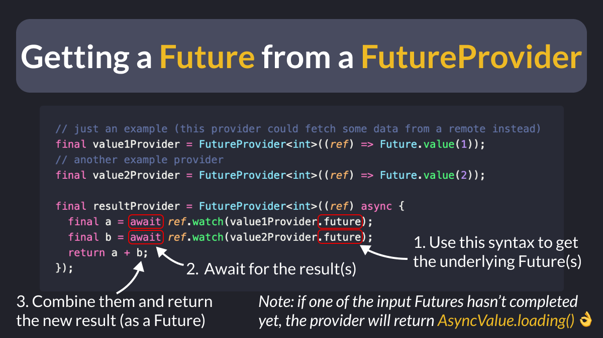

# Getting a `Future` from a `FutureProvider` with Riverpod

Did you know?

If you have a Riverpod `FutureProvider`, there’s an easy way to get the underlying `Future`.

Very handy when you want to await multiple Futures and combine the result.

Works with `StreamProvider` and `Stream` too. 👌

| Previous | Next |
| -------- | ---- |
| [Record Equality in Dart 3](../0109-records-equality/index.md) | [Destructuring Lists in Dart](../0111-destructure-lists-dart/index.md) |
