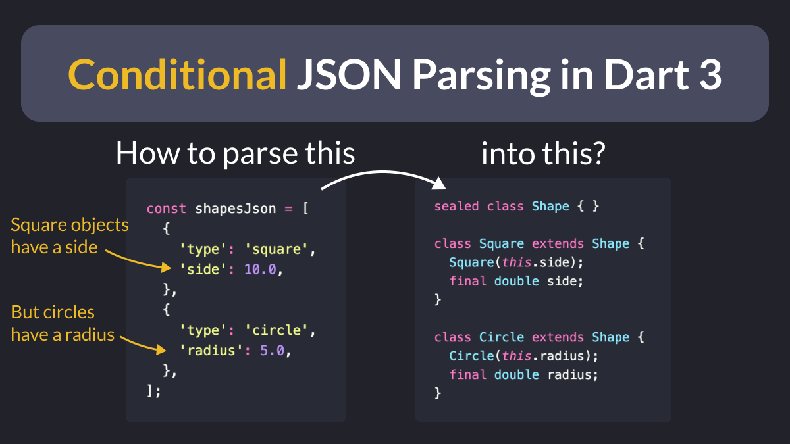
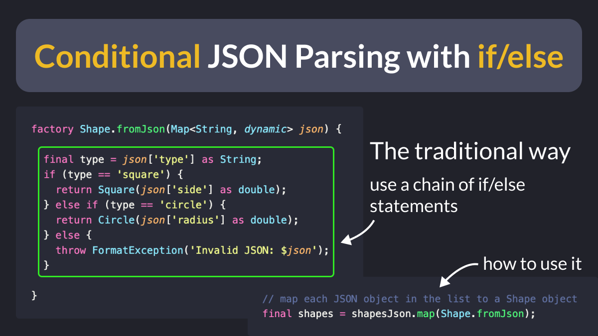
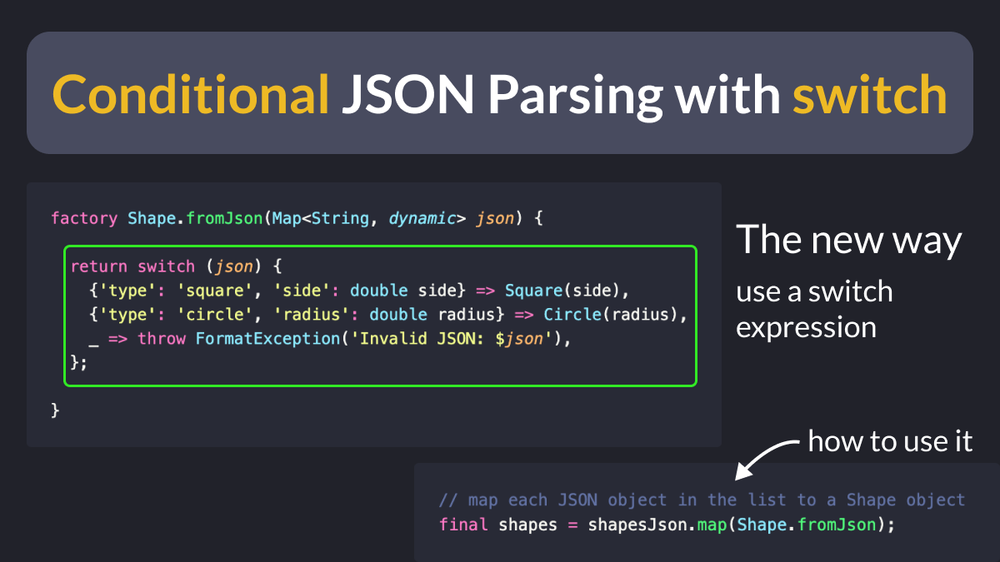

# Conditional JSON parsing in Dart 3

How do you parse JSON objects that may contain different properties depending on a given field?

An example of this would be when you have a `Shape`` class with two subclasses:

- a `Square` (with a "side" property)
- a `Circle` (with a "radius" property)

Let's take a look. 👇

---

To begin, add a factory constructor to the base class (this will contain the parsing code).

Then, you can write some conditional logic as a chain of if/else statements.

And depending on the type, you can return `Square` or `Circle`` instances as needed.

---

As an alternative, you can use switch expressions.

This way, you can leverage pattern matching to restructure the properties you need (side, radius) and return the corresponding objects. 👌

---

 

| Previous | Next |
| -------- | ---- |
| [Switch Matrix in Dart 3](../0112-switch-matrix/index.md) | [6 steps to minimize your Firebase Bill](../0114-minimize-firebase-bill/index.md) |
