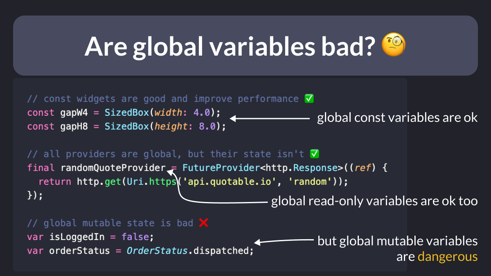

# Are global variables bad?

Are global variables bad?

Well, it depends.

In my projects, I often create global variables such as const widgets or Riverpod providers, and there’s nothing wrong with that!

But global MUTABLE state IS dangerous (hard to know who changed it and which widgets should rebuild).

| Previous | Next |
| -------- | ---- |
| [Measuring execution time in Dart](../0116-measure-time/index.md) | [Inspecting Network Requests (DevTools)](../0118-network-view-devtools/index.md) |