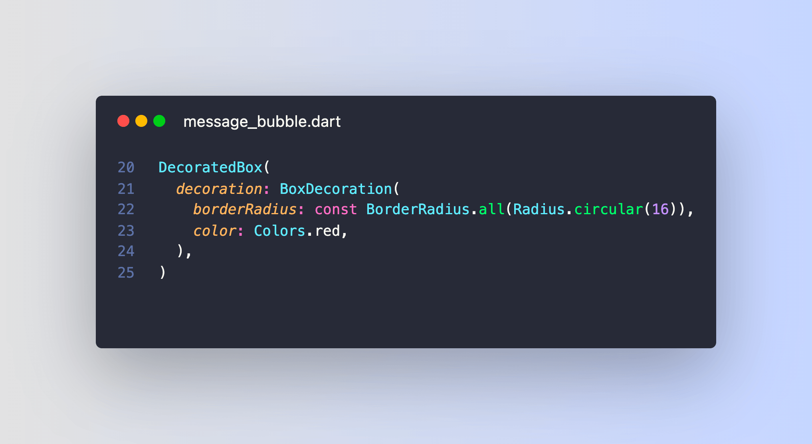

# How to set the border radius on a Flutter container

I've been a Flutter dev for 3 years and I still need to Google "Flutter Container border radius" sometimes. 😅

Let's put it to rest! This is the easiest way to get a rounded rectangle with a given radius:

 
| Previous | Next |
| -------- | ---- |
| [Flutter Fix all command](../0006-flutter-fix-all-command/index.md) | [Chat UI with message bubbles](../0008-chat-ui-with-message-bubbles/index.md) |