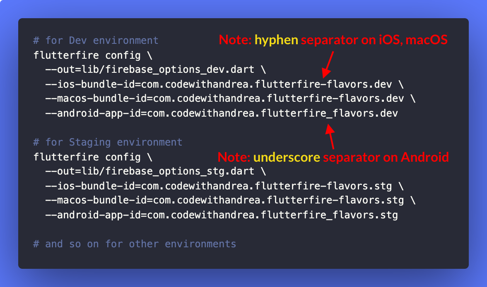

# How to configure multiple Firebase environments with FlutterFire CLI

Did you know?

The `flutterfire` CLI already supports multiple flavors/environments.

Just use it like this for each Firebase environment:

 
| Previous | Next |
| -------- | ---- |
| [How to use Robot Testing to write more readable widget tests](../0019-how-to-use-robot-testing-to-write-more-readable-widget-tests/index.md) | [Repositories as abstract classes (program to interfaces, not implementations)](../0021-repositories-as-abstract-classes/index.md) |