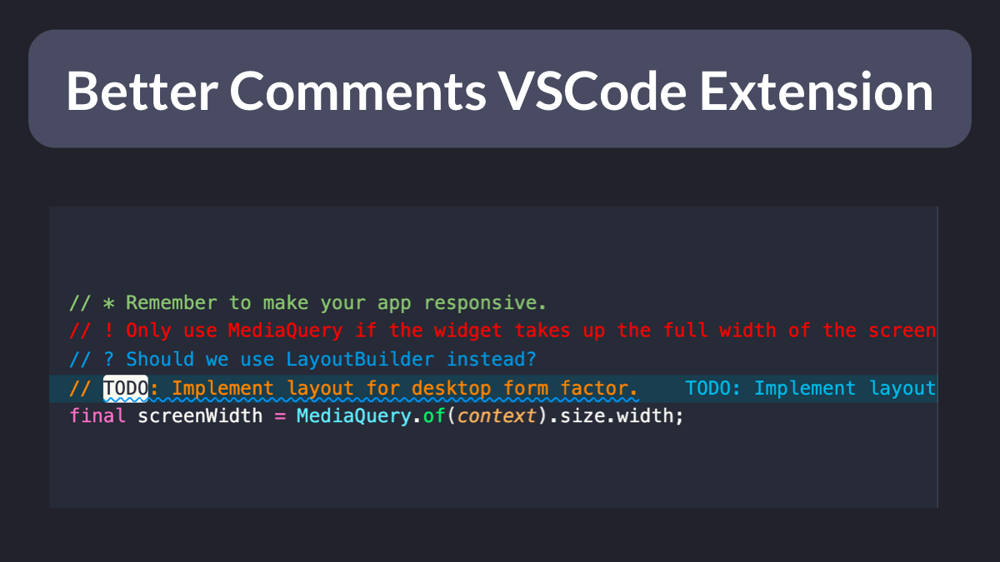

# Better Comments Extension for VSCode

Want to your comments to stand out more?

Just install the Better Comments extension for VS Code.

Then you can use various special characters to categorize your annotations.

Link: https://marketplace.visualstudio.com/items?itemName=aaron-bond.better-comments&ssr=false#review-details

 

| Previous | Next |
| -------- | ---- |
| [Running tests with GitHub actions](../0026-running-tests-with-github-actions/index.md) | [DDD: The Domain Model](../0028-ddd-the-domain-model/index.md) |