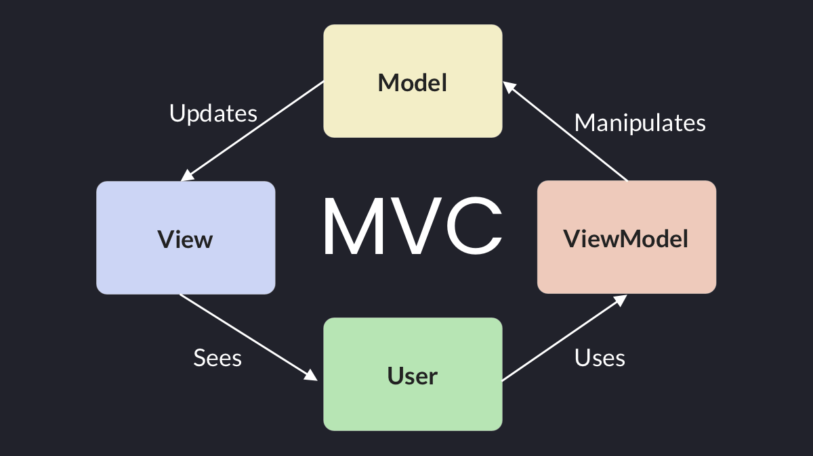
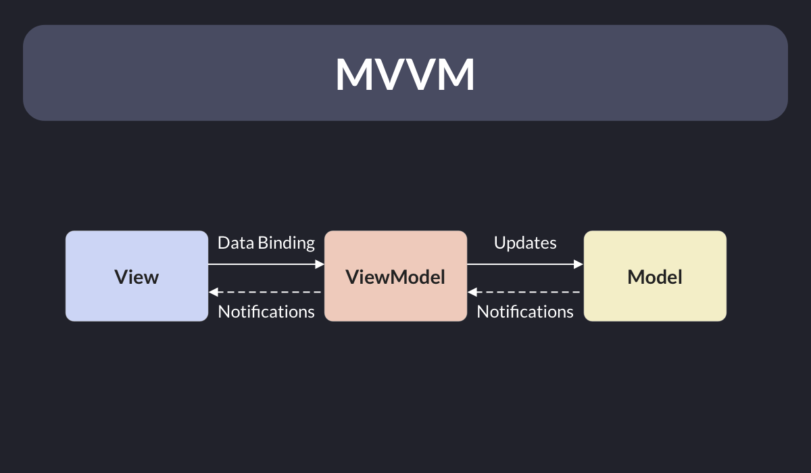
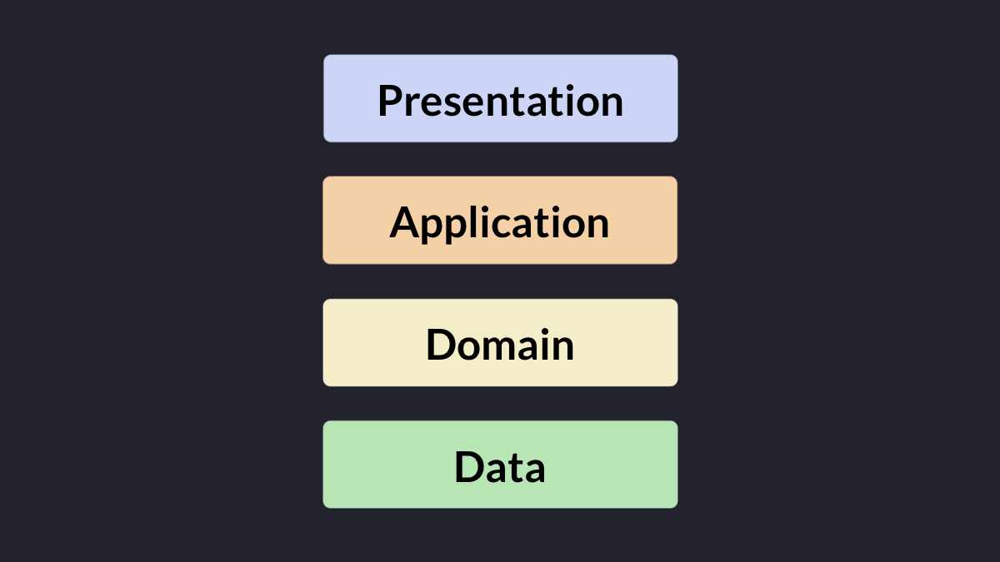

# Popular architectures for Flutter development

What are some popular architectures that are suitable for Flutter App Development (and which one to choose)?

It boils down to what level of complexity you need to handle. 👇

Thread. 🧵

---

(1/2) Model–view–controller (MVC) is a software design pattern made of 3 types of components:

- Model: directly manages the data, logic, and rules of the application
- View: UI components (widgets)
- Controller: Accepts input and converts it to commands for the model or view

---

(2/2) MVC typically overloads the model with too much logic, and an additional service layer is often added: MVC+S

The Model should be reactive (e.g. using ChangeNotifier) so that the widgets rebuild when the model changes.

And user inputs always go through the controller.

---

(1/2) Model-view-viewmodel is also a design pattern made of 3 components:

- Model: directly manages the data, logic, and rules of the application
- View: UI components (widgets)
- ViewModel: mediates between the view and the model. 

---

(2/2) The View and the ViewModel are connected with a data-binding based on the observer pattern.

When usign MVVM, the view can't access the model directly.

Rather, the ViewModel handles user inputs and converts the data from the Model so it can be easily presented.

---

Clean Architecture takes separation of concerns to the next level.

It is quite complex, requiring a bigger learning curve and considerably more boilerplate.

Some people swear by it and say it's worthwhile for large codebases:

More info here:
https://blog.cleancoder.com/uncle-bob/2012/08/13/the-clean-architecture.html

---

(1/2) Bloc Architecture is an architectural pattern built on top of the flutter_bloc package:

It allows us to separate our application into three layers:

- Presentation (widgets)
- Business Logic (blocs)
- Data (Repository & Data Provider)

----

(2/2) It is a very opinionated architecture that uses streams to communicate between widgets and blocs (and between blocs themselves).

It's used by many teams and is very well documented - but sometimes criticised for requiring too much boilerplate:

https://bloclibrary.dev/#/architecture

---

(1/2) Stacked is a package + architecture that began as a MVVM implementation for Flutter.

- View: Shows the UI to the user.
- ViewModel: Manages the View state, business logic, and logic to handle user interaction
- Services: similar to the data layer in other architectures

---

(2/2) Stacked provides a base architecture and an extensive set of useful widgets that make your life easier so that you don't have to reinvent the wheel.

https://pub.dev/packages/stacked

---

So, which architecture should you choose?

Turns out, this is not as important as defining clear contracts and boundaries in your app.

I really like this quote from the eBay engineering blog: https://tech.ebayinc.com/engineering/ebay-motors-state-management/

---

In practice, for small and medium-sized apps, most of the architectures above provide a good starting point.

And they're certainly better than having no architecture at all.

So pick one and try it out. Maybe your code won't be great on the first try, but that's ok.

---

Need more guidance?

Over the last few months, I built a complete eCommerce app applying many techniques from Domain-Driven Design and trying out various design patterns.

I ended up with a Riverpod-based architecture that uses 4 layers with clear boundaries:

----

I came away with many valuable insights about how to use DDD, app architecture, state management, testing, and much more in real world apps.

And I've shared them all in my new Flutter course:

 

| Previous | Next |
| -------- | ---- |
| [Rules to follow for good app architecture](../0037-rules-to-follow-for-good-app-architecture/index.md) | [Flutter Project Structure: Feature-first or Layer-first?](../0039-flutter-project-structure-feature-first-or-layer-first/index.md)  |