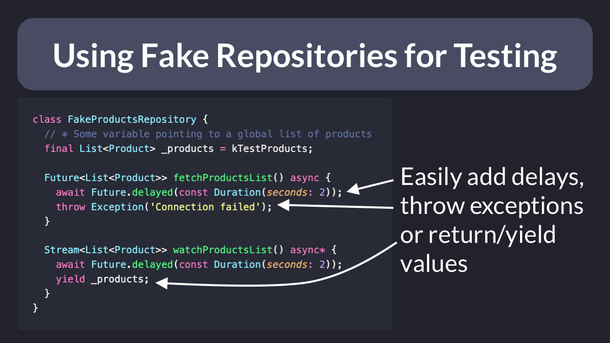

# Using Fake Repositories for Testing

In Dart, we can easily create mocks with packages like [mockito](https://pub.dev/packages/mockito) or [mocktail](https://pub.dev/packages/mocktail).

But sometimes it's quite handy to create fakes that can be configured in many different ways (and even store some state).

I often do this to test loading and error states in the UI. 👇

 

| Previous | Next |
| -------- | ---- |
| [Anatomy of a Riverpod Provider](../0040-anatomy-of-a-riverpod-provider/index.md) | [How to Generate and Analyze a Flutter Test Coverage Report in VSCode](../0042-how-to-generate-and-analyze-a-flutter-test-coverage-report-in-vscode/index.md) |