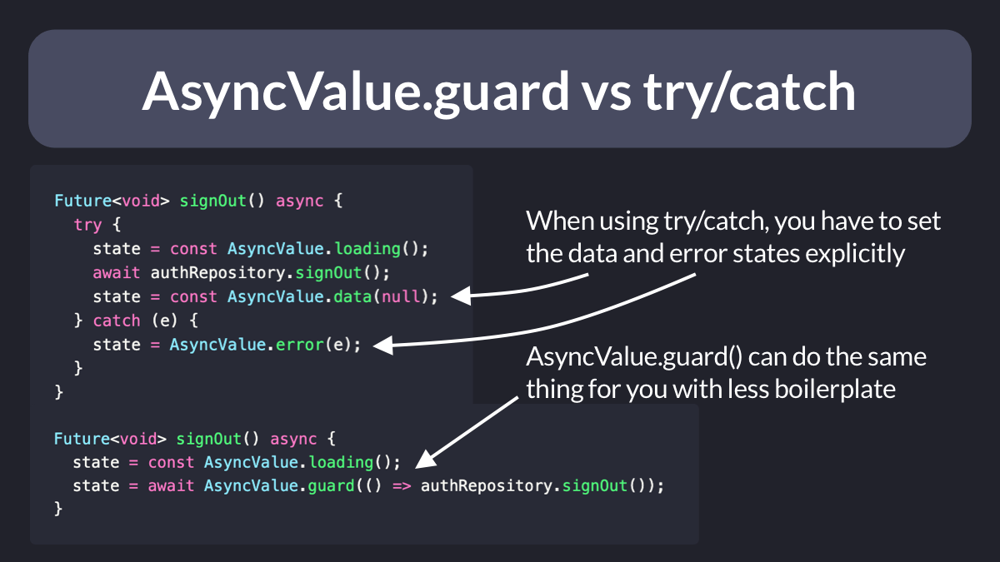

# `AsyncValue.guard()` vs `try`/`catch`

Riverpod tip. 👇

You can replace tedious `try`/`catch` blocks with `AsyncValue.guard()` inside your `StateNotifier` subclasses.

 

| Previous | Next |
| -------- | ---- |
| [How to write a reactive in-memory store with RxDart](../0043-how-to-write-a-reactive-in-memory-store-with-rxdart/index.md) | [The `Map.update()` method](../0045-the-map-update-method/index.md) |