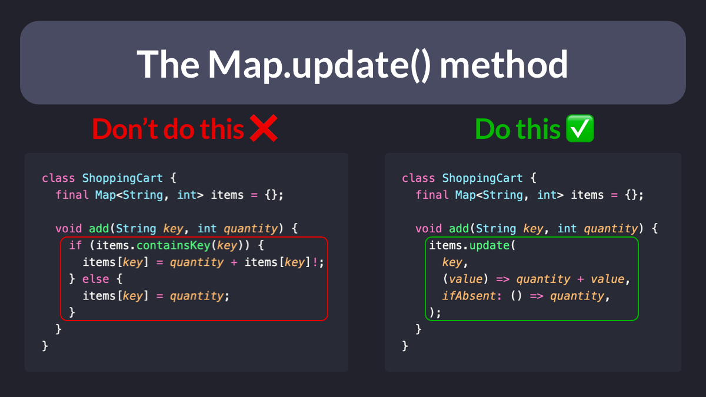

# The `Map.update()` method

A common requirement when working with maps is to:

- Update the value if a given key already exists
- Set the value if it doesn't

You may be tempted to implement some conditional logic to handle this.

But the `update()` method offers a simpler way of doing the same thing: 👇

 
| Previous | Next |
| -------- | ---- |
| [`AsyncValue.guard()` vs `try`/`catch`](../0044-async-value-guard-vs-try-catch/index.md) | [Riverpod: difference between `ref.watch`, `ref.read`, `ref.listen`](../0046-riverpod-difference-between-ref-watch-ref-read-ref-listen/index.md) |