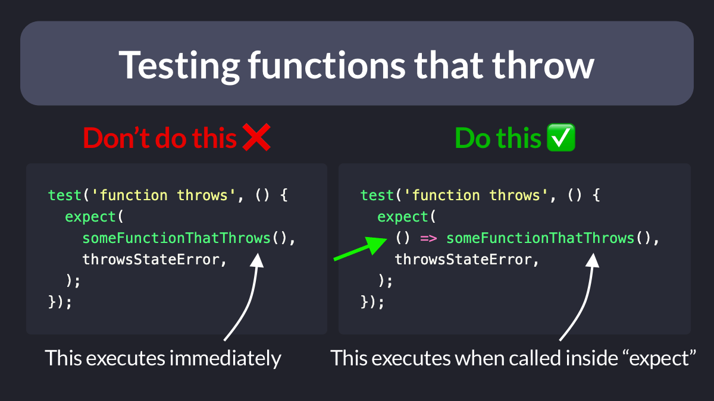

# Testing functions that throw

When writing test expectations for functions that throw, we need a bit careful.

If we call the function directly, the test will fail as it won't catch the exception as we expect.

In these cases, we should always pass a closure when calling the `expect` method as shown here. 👇

---

Here's a comparison I made to explain why calling the method directly won't work.

These two implementations are equivalent. And they both fail because the function will execute and throw *before* `expect()` is even called. 👇

---

Hope this will save you some headaches. 👍

For more Flutter tweets like this, follow me: [@biz84](https://twitter.com/biz84)

Happy coding!

 
| Previous | Next |
| -------- | ---- |
| [Why write automated tests?](../0047-why-write-automated-tests/index.md) | [Dart 2.17: Super Initializers](../0049-dart-2-17-super-initializers/index.md) |