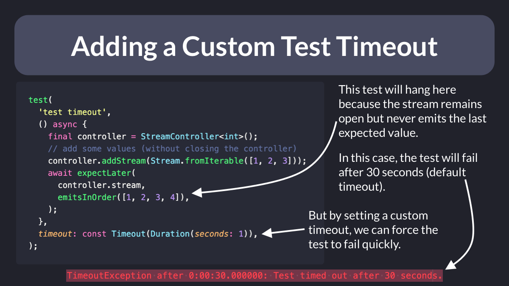
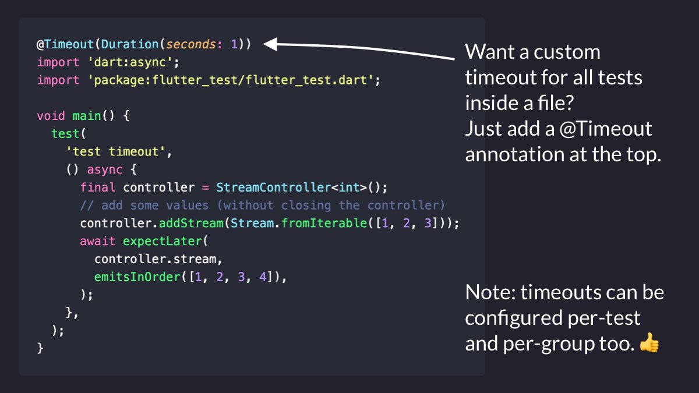

# Adding a Custom Test timeout

Did you know?

When writing tests in Flutter, you can add a custom timeout argument.

This is very useful for tests that can potentially hang (when waiting on an asynchronous stream matcher). 👇

If you have many tests running on CI, this can save you a lot of time and money! 💰

---

You know what else is cool?

Custom timeouts can be configured per-file, per-test, or per-group, just like this. 👇

 
| Previous | Next |
| -------- | ---- |
| [Golden Image Testing with Robot Testing](../0051-golden-image-testing-with-robot-testing/index.md) | [How to Create DartPad Examples from GitHub Gists](../0053-how-to-create-dartpad-examples-from-github-gists/index.md) |
