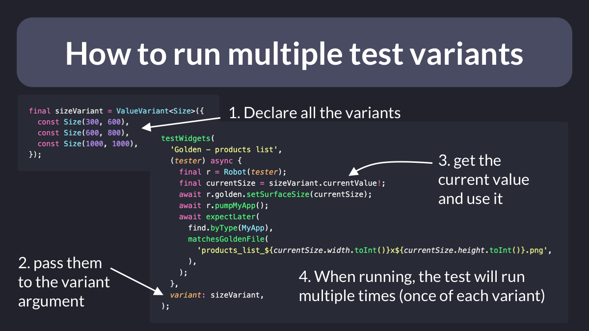

# How to run multiple test variants

Did you know?

You can run a widget test multiple times with different variants using the `variant` argument.

This is quite useful if you have a responsive app and want to run a golden image test for different screen sizes. 👇

 
| Previous | Next |
| -------- | ---- |
| [Riverpod tip for less boilerplate (Passing Ref)](../0054-riverpod-tip-less-boilerplate/index.md) | [Riverpod: Async init with Provider Overrides](../0056-async-init-provider-overrides/index.md) |
