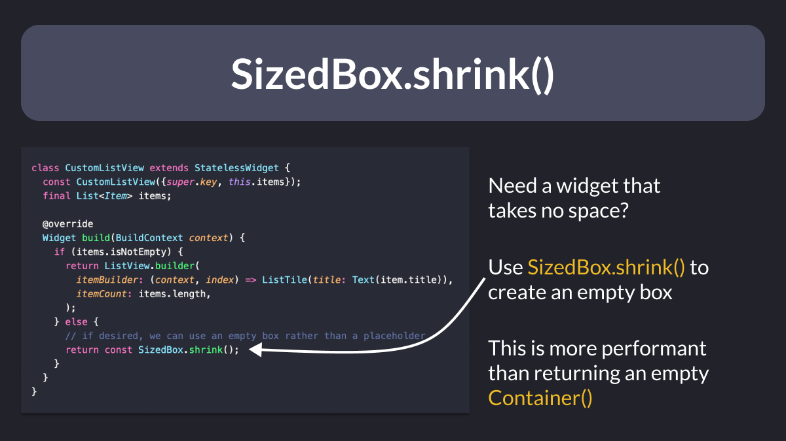
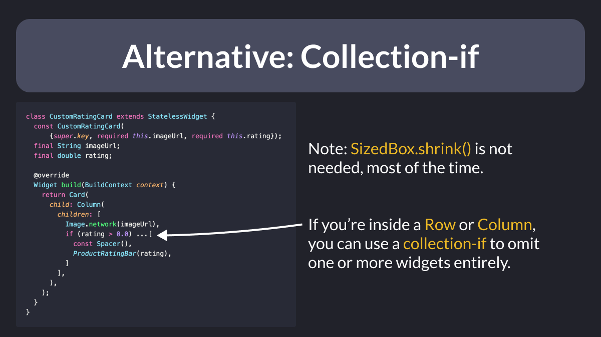

# When to use `SizedBox.shrink()` to return an empty box

Ever needed to return an empty box (that takes no space) in Flutter?

There's a widget for that → `SizedBox.shrink()`

This is more performant than returning an empty `Container` (which is complex inside and can't be declared as a `const` widget).

---

Note that in many cases, you can avoid returning a widget in the first place.

For example, if you are inside a `Row` or `Column`, you can just use the **collection-if** operator instead. 👇

 

| Previous | Next |
| -------- | ---- |
| [--enable-asserts flag in Dart / Flutter](../0068-enable-asserts-flag/index.md) | [Flutter app localization in 5 min](../0070-localizations/index.md) |
