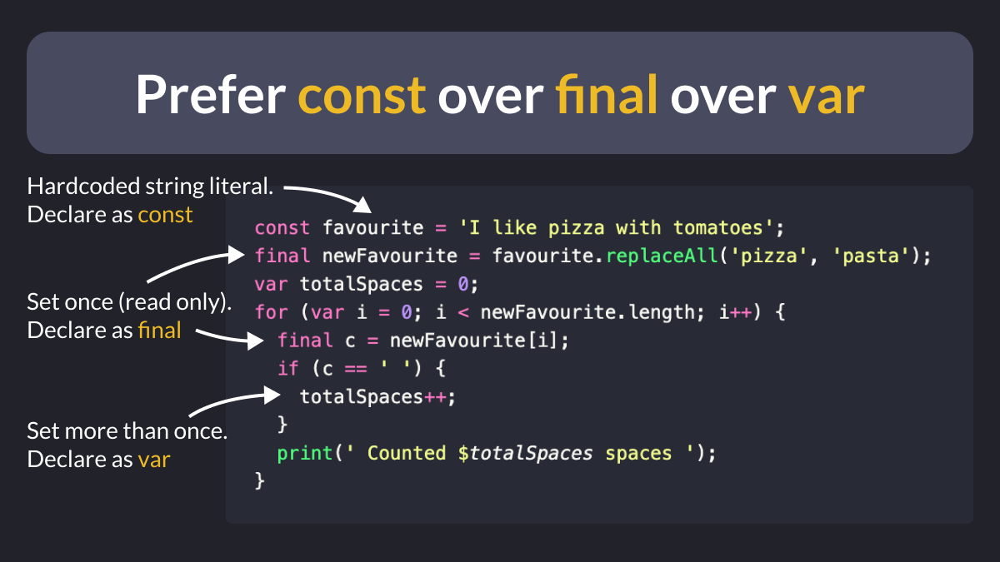

# Prefer `const` over `final` over `var`

When declaring variables in Dart, prefer `const` over `final` over `var`:

- `const` is for hardcoded, **compile-time constants**
- `final` is for read-only variables that are **set just once**
- `var` is for variables that are **set more than once**

The static analyzer will help you choose wisely. 🙂

 
| Previous | Next |
| -------- | ---- |
| [Flutter app localization in 5 min](../0070-localizations/index.md) | [Use type annotations for safer code](../0072-use-type-annotations-for-safer-code/index.md) |