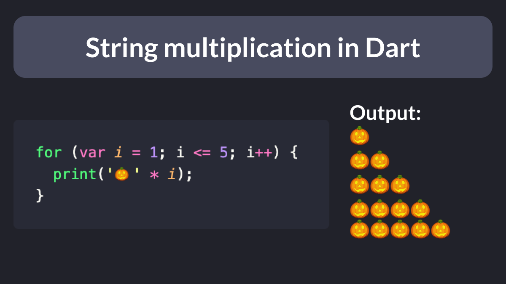

# String multiplication in Dart

Did you know?

Dart supports string multiplication.

Very useful when you want to check if long strings are rendered correctly in your Flutter layouts.

 
| Previous | Next |
| -------- | ---- |
| [How to nest generated files in VSCode](../0078-file-nesting-vscode/index.md) | [How to nest generated files in VSCode](../0080-future.wait/index.md) |