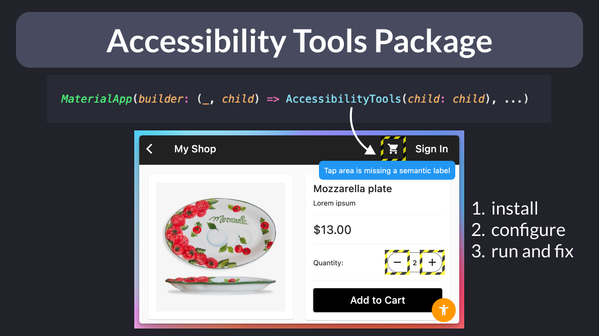

# The Accessibility Tools package

Looking for an easy way to make your Flutter apps accessible?

Then use the [accessibility_tools](https://pub.dev/packages/accessibility_tools) package to discover:

- missing semantic labels
- small tap targets
- large font overflows

And fix them in a breeze! ✨

 

| Previous | Next |
| -------- | ---- |
| [Dart code samples in the Firebase docs](../0086-firebase-docs-dart-samples/index.md) | [Get a single item from a list](../0088-list-single/index.md) |