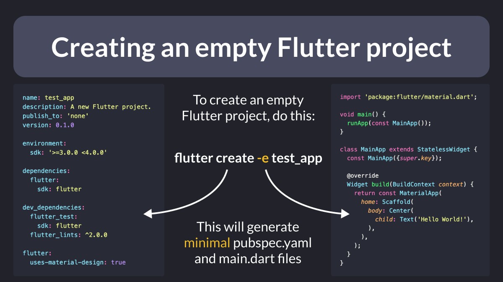

# Creating an empty Flutter project

Want to create an "empty" Flutter project without all the counter app boilerplate code?

Then simply pass a "-e" flag on the command line. Example:

```
flutter create -e test_app
```

This will generate minimal `pubspec.yaml` and `main.dart` files (without any comments). 👇




| Previous | Next |
| -------- | ---- |
| [[core/duplicate-app] A Firebase App named "[DEFAULT]" already exists](../0104-firebase-duplicate-app/index.md) | [Return without `async`/`await`](../0106-return-no-await/index.md) |


