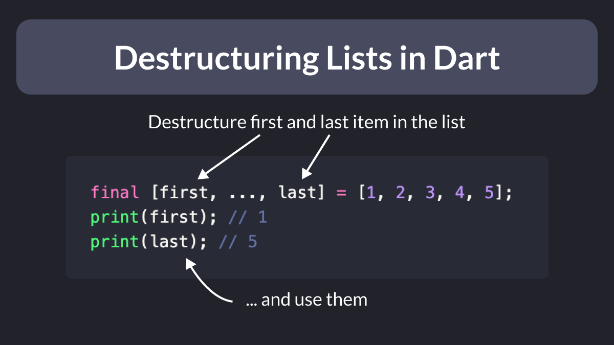
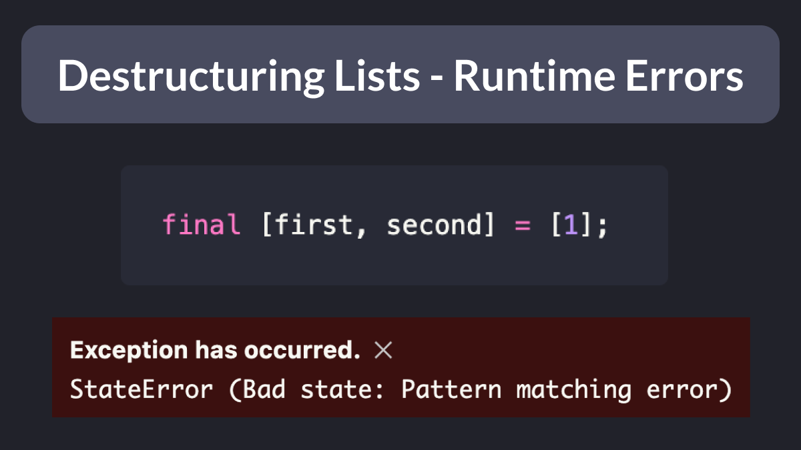

# Destructuring Lists in Dart

Did you know?

Since Dart 3, you can easily destructure lists using the spread operator (...).

Very handy for getting the first and last value. 👌

---

Note that if the list has only one element, you'll get a pattern matching error at runtime!

So make sure your assumptions are correct before using this. 👇

---

This example was taken from Pascal Welsch's talk about "Exploring Records and Patterns" at FlutterCon.

Check the slides for many more tips about this topic:

- [Exploring Records and Patterns | FlutterCon Berlin 2023 slides](https://docs.google.com/presentation/d/10qpjH16WISV5lYV1bR0r3USB4ggjReA7PjcyK1KyhDE/edit#slide=id.g14d15a4acf1_0_10)
 
| Previous | Next |
| -------- | ---- |
| [Getting a `Future` from a `FutureProvider` with Riverpod](../0110-riverpod-watch-future-provider/index.md) | [Switch Matrix in Dart 3](../0112-switch-matrix/index.md) |
