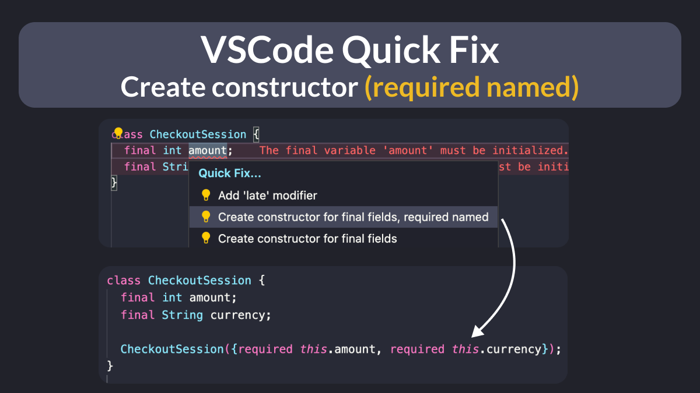

# VSCode Quick Fix: Create constructor for final fields, required named

Did you know?

With the latest VSCode, you can use the Quick Fix assist to generate a constructor with REQUIRED NAMED final fields. 🎉

Great time saver! I love it already! ❤️

| Previous | Next |
| -------- | ---- |
| [How to Inspect Network Requests with the Flutter DevTools](../0118-network-view-devtools/index.md) | [Flutter web: redirect to an external URL](../0120-set-html-window-url/index.md) |