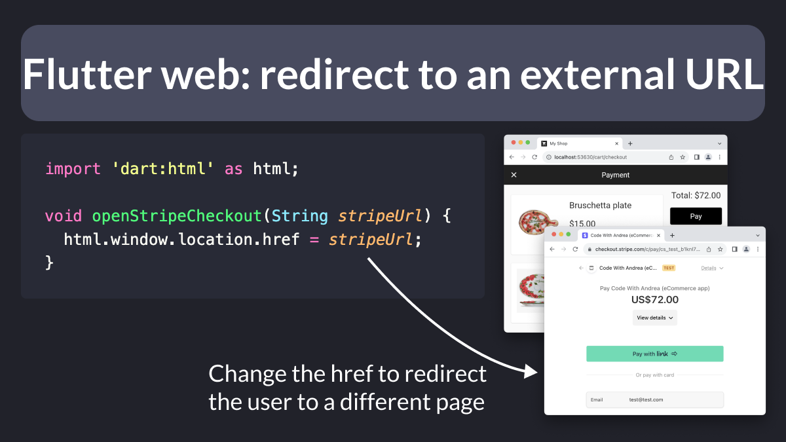

# Flutter web: redirect to an external URL

Did you know?

With Flutter web, you can redirect the user to an external page by changing the window href property.

Very handy for checkout pages (e.g. Stripe).

---

Note that dart:html can't be imported if you're targeting mobile or desktop.

To work around that, you can use conditional imports.

More info here: 👇

- [Conditionally import files at compile time](https://codewithandrea.com/videos/top-8-tips-for-flutter-web-firebase/#7-conditionally-import-files-at-compile-time)

| Previous | Next |
| -------- | ---- |
| [VSCode Quick Fix: Create constructor for final fields, required named](../0119-constructor-required-named-vsassist/index.md) |  |

